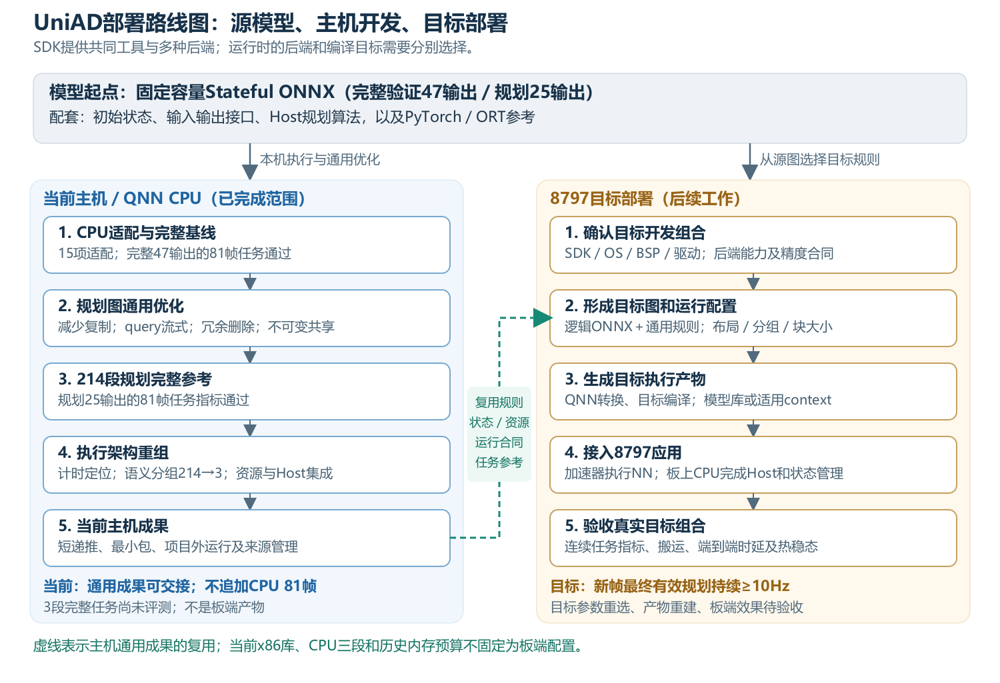

# UniAD部署准备工作汇报：从ONNX模型到8797板端部署

更新：2026-10-08。本文介绍基于已导出ONNX模型开展的主机开发目标、实现过程和成果，以及这些工作在后续8797部署中的用途。

## 1. 项目目标与已有模型基础

项目最终目标是把UniAD部署到8797平台，在满足实际设备资源要求的前提下，尽量缩短从新输入帧到最终有效规划轨迹的时间，并争取持续达到至少10Hz。10Hz意味着每秒处理至少10个新帧；如果每帧都要实时处理，对应的帧周期预算为100ms。这个预算需要覆盖神经网络、必要数据搬运、规划后处理和状态管理。

UniAD根据多相机图像和车辆运动信息进行感知、跟踪、预测及规划。它不是互不相关地处理每一帧：本帧还需要上一帧生成的时序状态，本帧的新状态则要供下一帧使用。部署链路因此包括：**准备图像和前帧状态 → 执行神经网络 → 对原始规划轨迹做碰撞优化 → 输出最终轨迹，并提交有效的新状态。** 碰撞优化在本文中称为Host处理；部署到8797后，这部分可以运行于板上CPU。

前期模型准备工作已形成固定容量的Stateful ONNX、初始状态、接口约定、Host规划逻辑以及PyTorch和ONNX Runtime参考。ONNX描述“要执行哪些计算”；它还不是能直接交给8797加速器运行的机器代码。固定容量表示用确定尺寸的张量承载对象和状态，配合有效性掩码表示实际对象数量，溢出仍要按既有规则处理。

项目保留两种输出范围：完整验证图提供47个输出，用于六项任务评测；规划图有23个输入、25个输出，保留规划、占用信息、递推状态和有效性检查所需接口。应用最终使用的是经过Host优化的有效轨迹。规划图仍保留其内部依赖，不能仅因少返回几个输出就认为相关计算已经被删除。

当前主机开发的目标是在当前主机上打通QNN（高通的模型转换与运行接口）执行和评测，减少重复复制与资源冗余，改进图的执行组织，并形成能供后续板端部署使用的规则、运行合同和参考结果。**当前主机通用工作已经收尾；8797目标产物、板端任务指标和10Hz表现尚待板端部署阶段完成。** 本阶段未量化、未降低分辨率或容量，也没有更换模型。

## 2. 整体路线图

### 2.1 先区分SDK、后端、编译目标和8797

**“当前后端是CPU，未来后端是8797”不够准确。** 8797是一颗芯片平台；后端是执行模型计算的实现，例如QNN CPU、GPU或HTP后端。HTP是高通的张量加速后端。部署到8797时，神经网络计划优先评估其加速后端，应用控制、状态管理及Host规划仍可能使用板上CPU。

高通官网下载的SDK没有按“CPU版”“8797版”分别呈现，并不意味着实际执行时不区分后端。本项目使用QAIRT工具套件中的QNN转换和运行能力。同一套工具包可以包含转换器、模型库生成器、公共API以及多种后端库；**在使用工具、准备模型和运行时，仍要选择目标体系。** 本机SDK目录同时存在CPU与HTP相关库，当前代码却明确生成x86模型库，并加载 `libQnnCpu.so` 执行。因此，本阶段确实是在主机CPU上运行，没有因为使用高通工具而自动调用8797加速器。高通的[CPU后端说明](https://docs.qualcomm.com/nav/home/cpu_backend.html?product=924033590759186372)和[主机到目标设备教程](https://docs.qualcomm.com/nav/home/qnn_tutorial_windows_host_linux_target.html?product=924033590759186372)也将后端库作为明确的运行选择。

| 层次 | 它决定什么 | 当前主机开发情况 | 板端部署需要明确的情况 |
| --- | --- | --- | --- |
| SDK版本 | 工具、API、支持范围和配套库 | 历史 Q4 为 2.31；当前公开主机参考为 2.42.0.251225 | 与8797实际系统及驱动匹配的SDK。 |
| 编译目标 | 模型库和应用使用哪种指令集、系统及应用二进制接口（ABI） | x86_64 Linux模型库与本机桥接代码 | 匹配板端系统的目标产物、应用和ARM依赖。 |
| 运行后端 | 实际调用哪套算子实现 | QNN CPU，加载CPU后端库 | 评估并选择HTP等目标后端，记录实际执行位置。 |
| 芯片与板级环境 | 有哪些执行单元及可用驱动、资源 | 当前开发主机，不是8797板子 | 8797及实际OS、BSP、驱动和设备资源。 |

编译目标和后端是两个不同选择。例如，ARM模型库可能仍使用CPU后端；在PC上拥有HTP工具库，也不能据此认为本机推理已经使用目标芯片的加速单元。转换器能接受模型、库能生成、后端能执行和板端速度达标，是四个不同阶段。

这对后续部署有三个直接影响。第一，x86库不能直接拿到ARM/HTP上使用，必须生成匹配目标的产物。第二，CPU已经支持的算子形状、数据类型和内部布局，目标后端可能有不同约束；CPU所需的补丁也可能在HTP上不再需要。第三，FP32输入输出不保证后端内部同样按FP32计算，内部运算和累加精度要单独确认。context是运行时管理计算图等资源的容器；在后端支持下，其准备结果可以保存为二进制。某些QNN context二进制还与目标SoC有关，需按对应工具链生成和验证，见[高通编译说明](https://workbench.aihub.qualcomm.com/docs/hub/compile_examples.html)。

高通负责提供后端算子及加速实现；本项目负责核对模型的实际算子组合、选择图适配和运行配置、接入应用并验证结果。应先利用SDK已有能力；只有出现明确的支持或性能缺口时，才评估额外实现。当前本机SDK是本阶段的验证工具，不等于已经确认适用于用户8797板子的完整开发组合。

### 2.2 从模型准备、主机开发到板端部署的完整路线

路线图包含两条相关的路径：左侧是已完成的主机开发，右侧是后续目标部署。**板端部署从逻辑ONNX及主机通用成果重新选择目标规则，不需要把当前CPU派生图和三段配置原样搬到板上。** 主机开发提供已验证的思路、代码和对照，目标仍需自己的编译与运行配置。

| 阶段 | 输入及主要处理 | 输出／当前位置 |
| --- | --- | --- |
| 模型与接口准备 | 固定容量、时序状态、规划及Host接口，形成参考执行材料。 | 逻辑ONNX、初始状态、Host算法和PT/ORT参考。 |
| 主机开发第一步：CPU执行与完整基线 | 对当前QNN CPU不直接支持的表达做等价适配；转换ONNX、生成模型库、加载实际CPU后端，接上真实数据和自身状态递推。 | 完整47输出版本的81帧任务参考；该基线为219段。 |
| 主机开发第二步：规划通用优化 | 在规划路径上减少复制、按query流式处理attention、删除冗余节点、共享不可变数据并精简运行包。 | 214段规划版本完成81帧任务评测，保留为完整规划参考。 |
| 主机开发第三步：执行架构优化 | 拆解时间瓶颈，保护连续算子消费链，比较多种分组；接入资源生命周期和实际新Host，验证短递推与独立运行。 | 当前3段规划候选及通用工具；6帧短链、两场景、新进程和项目外执行完成。 |
| 板端部署第一步：目标选择及产物生成 | 确认SDK/系统/后端和精度，从逻辑源图选择仍需的适配，重新确定布局、分组及流式参数，转换并目标编译。 | 板端可用的模型库或适用context、运行配置和应用依赖。 |
| 板端部署第二步：板端集成及验收 | 接入加速器与板上CPU、buffer注册/同步、Host和状态恢复；评测实际任务、时延和持续帧率。 | 最终部署及是否达到10Hz的设备结论；目前尚未完成。 |

## 3. 主机开发各项工作介绍

### 工作总览

本阶段既修改了图的计算表达，也修改了“图怎样被加载、传入数据、连续执行和打包”。这两类变化作用于不同瓶颈。下面先给总览，再逐项说明。 文中的“生产者”指生成某个结果的算子，“消费者”指随后读取这个结果的算子；检查全部消费者，是为了避免改写一条路径时遗漏另一条仍需要该结果的路径。

| 工作 | 具体改变 | 主要作用 |
| --- | --- | --- |
| 3.1 接通QNN CPU执行 | 15项静态处理及形状、索引、类型和接口适配；完成转换、编译及真实后端调用。 | 让已导出的ONNX模型进入高通运行体系，定位实际兼容约束。 |
| 3.2 连续帧运行与任务基线 | 本版本产生自己的下一帧状态，处理场景切换、检查点和恢复；完整及规划版本分别评测81帧。 | 建立任务正确性参考，避免只有单帧或借参考状态才能跑通。 |
| 3.3 减少输入复制与临时分配 | 连续且类型匹配的输入同步借用；预处理直接写最终缓冲；有限值检查分块进行。 | 减少重复搬运、编码和临时数组，保护输出生命周期。 |
| 3.4 流式attention | 大批query拆为当前每块2048个，保留采样、权重及归约语义。 | 降低一次生成的大中间张量规模。 |
| 3.5 删除有证明的冗余节点 | 删除1591个内部恒等view或同类型Cast，保留公开接口和必要变换。 | 简化执行表达，减少无意义操作及物化机会。 |
| 3.6 共享数据和最小包 | 9个不可变视图共享3个buffer；运行包只携带实际资源，脱离开发仓库验证。 | 避免重复常量和开发资源进入部署包。 |
| 3.7 从214段重组到3段 | 按完整消费者和算子区域切分，保护attention/卷积链，而非仅按累计张量尺寸切分。 | 减少跨段接口、布局往返和重复准备，保留融合机会。 |
| 3.8 资源与状态分开管理 | 分离prepare、execute、状态reset和close；绑定资源身份，明确失效、失败与返回值所有权。 | 为板端context和状态/buffer复用提供可靠运行规则。 |
| 3.9 Host求解器复用 | 复用碰撞优化问题的表达，每帧更新障碍和参考轨迹，保留回退。 | 避免重复创建同一类优化问题。 |
| 3.10 从源语义交接到目标 | 回溯图改写来源，识别源算子区域，区分通用规则和CPU适配条件。 | 使板端部署阶段能够重选目标实现，减少被CPU生成物绑定后的返工。 |

### 3.1 把已导出的ONNX接入真实QNN CPU执行

**问题是什么。** 模型计算能通过PyTorch参考或ONNX Runtime验证，并不保证当前QNN CPU接受其中所有表达。即使算子名称被支持，也可能在张量维数、广播、索引、标量接口或整数/布尔数据上遇到限制。

**具体怎么改。** 把“图表达适配”“工具转换”“后端实际执行”分开完成，避免将转换器成功等同于模型已经能推理。

1. **确认原图和接口。** 从配套的逻辑ONNX出发，固定输入输出名称、顺序、形状、数据类型及初始状态。先沿图推导张量形状和常量来源，再判断某个表达是否符合改写条件；不能只因节点名称相同就直接替换。
2. **按条件改写不被当前CPU路线接受的表达。** 对高维表示、广播、标量端口、布尔路由和特定整数操作使用等价表达。每项改写记录原节点、条件及新图身份，保护公开接口、整数精度、有效性掩码和对象容量。下表列出实际15项处理，并区分可通用的简化与后端兼容适配。
3. **生成本机模型库。** 适配后的ONNX先通过图和形状检查，再交给QNN转换器生成模型C++定义及权重文件；随后用模型库工具编译为x86库。这里的库负责在运行时向QNN构建计算图，并不等于已完成8797加速器的目标编译。
4. **加载真实后端并执行。** 桥接代码加载CPU后端和模型库，创建计算图并完成finalize准备；读取真实端口描述，与逻辑接口逐项核对后再提交输入。原生结果按明确映射还原为应用需要的类型和形状，随后接受数值、状态及任务检查。QNN失败时保留失败结果，不切换为ORT代算。

下表中的“维数”指张量有几条轴，例如图像特征可能由批次、通道、高、宽四条轴组成；“视图”指在元素含义和顺序不变时调整形状描述。**这些处理是当前CPU路线中观察到并记录的规则，不是8797必须照搬的补丁清单。** 固定控制和静态尺寸简化具有通用价值，其余项目应根据目标后端支持选择。所有处理均未通过量化、降低容量或把整数索引近似为浮点数来绕过限制。

| 适配项（记录名） | 原表达或适用前提 | 当前主机上的实际处理 | 8797部署时如何利用 |
| --- | --- | --- | --- |
| 固定控制与静态简化（static） | 形状控制可证明固定；整数ReduceProd和空Concat操作数可静态判定。 | 绑定固定控制值，精确折叠整数乘积，移除已证明为空的Concat操作数。 | 复用静态证明，按目标图重新应用；不折叠依赖本帧数据的值。 |
| 可变形卷积高维排列（dcn） | 特定Reshape → 六维Transpose → Reshape链，中间值没有其他消费者。 | 将高维排列改写为支持的较低维组合，保持元素排列和最终形状。 | 目标原生支持时跳过；需要时复用同一排列语义和检查条件。 |
| 前导单例轴处理（singleton） | 指定内部六维张量的前导轴长度为1，相关操作可保持轴含义。 | 暂时移除该单例轴并调整相关操作，保持逻辑形状及类型约定。 | 根据目标维数限制选用，不能修改公开端口或掩码含义。 |
| 高维打包（packed） | 内部高维张量或五维Transpose；相邻轴的广播和排列关系可证明。 | 合并合适的相邻轴，对支持的操作使用较低维表示，保留逻辑形状映射。 | 原维数可支持时跳过，否则按目标能力重新选择打包表示。 |
| Reshape模式保护（protected） | 标量或一维输入直接变为五维，遇到当前形状校验限制。 | 加入保持元素顺序的二维中间视图，再执行目标Reshape。 | 仅在目标存在同类限制时保留，避免增加不必要的视图链。 |
| 标量端口映射（ports） | 逻辑接口含标量，当前原生端口需要一元素张量。 | 端口使用一元素表示，在图内部和应用边界恢复标量含义。 | 按目标接口重新适配，保持名称、类型和整数位精度。 |
| 显式广播表达（tile） | Expand的形状与重复次数均由静态证明确定。 | 使用等价Tile表达；标量特例采用Identity。 | 优先评估原生广播及融合，避免机械保留显式复制。 |
| attention乘法广播（broadcast） | 特定采样值与权重相乘，形状为[B,C,Q,P]与[B,1,Q,P]。 | 合并查询位置Q和采样点P为一条轴，进行三维广播乘法后还原形状。 | 保留原乘法语义，三维表示只在目标需要时采用。 |
| 布尔路由（boolean） | 部分布尔Concat/Slice表达不被当前路线接受。 | 将布尔值精确映射为int32的0/1，完成路由后恢复布尔结果。 | 支持原生布尔路由时跳过，否则沿用精确映射。 |
| 常量负索引规范化（scatter） | Gather/ScatterND索引是常量，且在原轴的合法负索引范围内。 | 将负索引换算为对应非负位置，保持所指元素不变。 | 按目标索引约束选择；不把任意运行时索引当常量。 |
| 特定整数最大值（reduction） | 指定的六元素int64向量归约为标量最大值。 | 使用Gather取值、Greater比较、Where选择等表达完成精确整数归约。 | 可用原生整数ReduceMax时优先使用，否则保留等价规则。 |
| 静态尺寸表达（root-extents） | Shape/Size结果由已证明的固定尺寸决定。 | 直接替换为精确常量，减少运行时形状计算。 | 可通用复用，但每个新图都要重新验证尺寸来源。 |
| 整数范围裁剪（integer-clip） | int32/int64 Clip的上下界为同类型、有序常量。 | 使用Less/Greater比较和Where选择，保持全部整数位。 | 支持原生整数Clip时跳过，否则采用精确等价表达。 |
| 单位置整数写入（integer-scatter） | 一维ScatterND，只有一个已确定位置、一次更新且无归约。 | 将前段、更新值和后段以Slice/Concat拼接。 | 原生ScatterND适用时优先使用；不能把该规则推广为任意动态scatter。 |
| 高维逐元素索引（gather-elements） | 五维GatherElements，索引轴及末尾非索引尺寸符合已证明条件。 | 合并相同的末尾维度，完成索引后恢复逻辑形状，保持负索引语义及数据精度。 | 重新检查目标维数与索引支持，按需跳过或替换。 |

表内记录名对应已有逐项合同，保存了前置条件、依赖、源码身份和目标保留／跳过／替换规则。后续调整目标图时可以沿这些记录核对，无需重新猜测CPU改写的目的。

**意义及板端利用。** 这一步把抽象的“应该支持”变成了实际运行，并把兼容问题逐项明确。板端部署阶段可复用转换/检查流程及适配规则，但应按目标能力保留、跳过或替换规则。例如，若HTP原生支持某个高维操作，就应优先评估原表达，不必保留CPU为了降维而增加的变换。

### 3.2 建立自身状态递推、恢复和完整任务参考

**问题是什么。** UniAD有前后帧依赖。只拿某一帧与参考比较，不能证明下一帧读到正确状态；每帧注入参考版本的状态，还可能掩盖本版本的递推问题。

**具体怎么改。** 将单帧神经网络调用接成“读取状态 → 执行 → 检查 → 规划后处理 → 提交”的连续运行流程。

1. **准备本帧输入。** 场景首帧使用配套初始状态；同一场景后续帧读取本版本上一帧成功提交的状态，并加入本帧图像和车辆运动信息。不会在每一帧注入参考版本的状态来帮助候选运行。
2. **检查候选输出。** QNN产生规划、占用信息和下一帧状态后，核对形状、类型、对象数量、有效性掩码、溢出及NaN/Inf。检查失败时拒绝本次结果，避免将损坏状态继续传给下一帧。
3. **完成Host处理并提交。** 原始规划和占用信息进入碰撞优化，得到最终有效轨迹。整条有效性流程成功后才提交新状态；场景切换时按规则重新初始化，不能把上一场景的对象和历史带入新场景。
4. **保存、恢复并评价。** 检查点同时记录递推状态、场景信息以及配套模型和运行身份；新进程核验身份后恢复。逐帧应用结果整理成对应任务的预测格式，与同一数据范围和冻结指标的参考结果比较。

完整47输出版本和通用优化后的214段规划25版本，分别完成81帧、两场景的任务评测，按冻结指标与native PyTorch、固定接口PyTorch和ONNX Runtime参考比较通过。当前3段版本另完成6帧自身递推、两场景及新进程恢复，短规划指标在既有容差内。

**意义及板端利用。** 板端部署阶段能够复用输入、初始状态、任务对照和“成功后提交、失败后拒绝”的规则。当前主机开发收尾保留旧81帧指标，加上新分组的结构、同输入数值及短递推材料；不再启动新CPU 81帧。3段及新Host的完整任务仍记为未评测，这个范围与“通用成果可以交接”同时成立。

### 3.3 减少重复输入复制、预处理分配和检查开销

**问题是什么。** 一帧图像和状态会进入多个子图。如果每次调用都重新打包、转换为字节或复制成另一个数组，同一份数据会反复搬运。预处理先生成中间数组再复制到最终输入，也会增加分配和存储压力。

**具体怎么改。** 先减少应用和桥接层的重复数组，再明确每一份输入、输出的持有者和有效期。

1. **在预处理端减少中间数组。** 将图像转换结果直接写入最终输入缓冲，复用可复用的坐标等准备数据，避免先生成完整临时数组、再复制到最终输入的两次存储过程。
2. **在调用边界检查借用条件。** 对输入核对形状、数据类型、排列、连续性及对齐条件；满足原生接口要求时，同步执行直接借用已有缓冲。需要格式转换时才做必要处理，不能仅凭地址存在就认定可以借用。
3. **保持执行期间的所有权。** 从提交输入到原生调用返回，持有对应数组引用；调用结束前不能释放或修改缓冲。返回结果单独管理存储和有效期，避免关闭执行资源或下一次调用覆盖仍在使用的结果。
4. **分块完成有限值检查。** 将大数组按有限大小逐块检查NaN/Inf，逐块处理检查结果，避免额外创建与整个输入一样大的布尔数组。该检查的临时工作空间（scratch）控制在256KiB以内。

借用不意味着任意返回一个裸指针。本阶段验证旧输出在下一次调用、场景reset及close之后仍有效，并保留必要的输出所有权。当前短链的bridge显式输入复制为零；这只描述这一接口，SDK内部是否复制仍需另测。

**意义及板端利用。** 板端部署阶段可沿用“谁拥有缓冲、何时可以借用、执行结束前不能释放、哪些结果必须独立保留”的规则。目标设备还要接入自己的内存注册、缓存一致性和同步机制，不能把NumPy地址直接等同于设备零复制。减少无意义复制的目标可迁移，CPU借用代码需要后端适配。

### 3.4 把大attention中间张量改成按query流式处理

**问题是什么。** 可变形attention要为许多query位置提取多个尺度的采样特征、乘权并归约。若一次生成所有query的采样和乘权结果，会产生很大的中间张量。query可以理解为需要从特征中提取信息的查询位置。

**具体怎么改。** 沿查询位置轴切分计算，保留每个查询内部原有的采样、乘权和归约过程。

1. **定位完整attention区域。** 在六个区域中识别采样特征、采样坐标、权重和归约结果，核对形状、属性及全部消费者，确认替换不会遗漏其他使用者。
2. **同步切分坐标和权重。** 将查询位置按连续区间分块，当前CPU配置每块2048个query；同一区间的采样坐标与权重一起切片，最后一块按剩余长度处理。各特征尺度的输入特征保持原含义。
3. **为每块生成完整计算链。** 按原顺序从四个特征尺度采样，连接对应采样值，乘以本块权重，再沿原采样点轴完成总计32个点的归约。当前CPU所需的乘法维数适配与流式规则分开选择，不改变原归约顺序。
4. **连接结果并检查边界。** 将各块已归约的结果按原query顺序拼回原输出，核验全部输入输出接口和权重保持一致。所有query仍参与计算，没有丢弃采样点或降低模型容量。

改写后，理论单个大中间值由约2.006GB降到约403MB。这描述图中单个张量规模；各块是否按预期调度、空间是否被后端及时复用，还要看实际执行，不能直接据此推算进程峰值或DDR流量。

**意义及板端利用。** 这项工作降低了一次物化所需的空间，为资源有限时运行模型提供选择；它没有减少应完成的采样计算。分块也可能增加调度开销，因此不保证每个后端都更快。板端部署阶段复用流式变换和数学保护，根据目标内部buffer、算子能力和实测速度选择块大小，2048不作为8797固定参数。

### 3.5 简化有证明的恒等表达，保留真正必要的变换

**问题是什么。** 图经过导出和适配后，包含一些实际不改变元素、形状或类型的表达。若它们仍作为独立节点进入执行链，可能增加调度或数据物化；但看起来像Reshape或Transpose的操作也可能是真正必要的布局变换，不能一律删除。

**具体怎么改。** 先证明某个表达不改变结果，再将所有消费者接到真实数据来源，最后检查整个图仍然闭合。

1. **筛选能够证明为恒等的节点。** 利用固定形状和类型推导，识别输入输出形状相同且目标形状已知的Reshape、类型未变化的Cast、Identity和不改变轴顺序的Transpose。真正改变排列、类型或元素关系的操作继续保留。
2. **建立结果别名并改接消费者。** 对可删除节点，把它的输出映射到实际生产者；处理连续恒等链时继续追到真实来源，并重连后续所有使用者，避免只处理其中一条路径。
3. **保护公开接口和必要适配。** 不直接删除公开输出的名称；可以安全处理的公开同类型Cast，将输出名转移到真实生产者。当前CPU确实依赖的标量／维数保护继续保留，不因看起来像视图而删去。
4. **复查图与运行依赖。** 检查公开接口、类型、形状和图连接，并在分段执行计划中重新核对每个中间值的最后消费者，只在不再被后续段使用时释放。

当前实际删除1591个冗余节点。减少图节点只证明这些表达被简化，不代表SDK已消除全部内部拷贝或减少了主要数学计算。

**意义及板端利用。** 可证明的冗余表达简化可以保留到目标准备中；目标后端是否将剩余Reshape实现为视图，是否仍需要布局拷贝，由目标生成图决定。这项工作没有把“少返回几个输出”当成“内部计算已经被裁掉”。

### 3.6 共享不可变数据，形成最小运行包

**问题是什么。** 相同的确定性操作数可能在多个子图里重复生成或保存；打包时若复制整个开发目录，还会携带ONNX、转换中间文件、数据集和评测档案。它们不都是运行一个新帧所必需的资源。

**具体怎么改。** 将“计算过程中复用什么”和“部署包必须携带什么”分别整理，避免常量与开发材料混在一起。

1. **找出真正不随帧变化的数据。** 沿依赖判断候选值是否由确定性常量路径产生，并确认其形状、类型及各消费者。递推状态、图像和依赖本帧输入的结果不进入共享池。
2. **按内容建立共享存储。** 对可复用值核对数据内容和布局，将相同底层数据保存为一个buffer，其他形状以视图引用。当前9个视图对应3个唯一buffer，解压后总计122.88MB，压缩保存约36.03MB；加载时校验内容身份及视图解释。
3. **把共享值接入分段执行。** 使用共享池提供原来的子图输入，保留各消费者所需的名字、类型和形状。这样减少重复生成或存储的机会，但不自动保证SDK内部也采用同一份设备存储。
4. **按实际依赖构建运行包。** 从可执行入口逐项收集模型库、桥接代码、Host、常量、初始状态、配置和清单；不把整个开发目录复制进去。ONNX开发图、转换中间文件、GT、数据集及逐帧评测档案留在开发环境，运行包只携带调用所需资源。
5. **在仓库外核验包。** 换独立目录和新进程执行真实输入、场景切换及恢复，确认没有偷偷读取开发目录中的资源，再核对最终规划。临时副本只在任务结束且内容确认一致后清理，保留候选包和验证记录。

早期规划包约1.17GB，通用优化后的已接受214段包约669.77MB，当前3段候选包20个普通文件、约628.75MB。其中3个CPU模型库约580.39MB。这些包大小不包含已安装的系统/Python/求解器依赖；当前包也不是8797包。

候选包还在开发仓库外完成2+4帧真实运行，检查依赖、场景切换、检查点恢复和最终规划。两份已经结束且内容核对一致的临时库包副本已清理；唯一候选和运行记录保留。

**意义及板端利用。** 板端部署阶段复用不可变数据去重及“只携带实际运行闭包”的打包方法，生成目标库后重新盘点资源。跨图常量最终能否共享及如何注册，仍要按目标后端检查；不能把约629MB直接当成未来板端安装占用。

### 3.7 根据时间瓶颈重组图：从214段到3段

**问题是什么。** 214段表示把一个完整规划计算图分成214个可执行子图。最初按拓扑和累计张量规模切分，以便在当前工具及主机条件下执行。模型库已提前编译，但每帧仍重复加载、构建运行图并finalize，再执行和销毁。这些边界也使大中间值成为显式输入输出，并可能增加布局转换。

**具体怎么改。** 用实际时间定位问题，再按完整数据依赖重新选择边界，最后比较候选的可行性与总耗时。

1. **分开测量耗时。** 区分模型加载／图准备、原生API执行、跨段边界、Host和记录开销，并结合旧SDK诊断定位布局转换及反复finalize。这样能判断该改图边界，还是该改应用层处理。
2. **标记不宜切开的语义区域。** 沿生产者和全部消费者识别“采样 → 乘权 → 归约”以及卷积、激活、残差等连续链，把大中间值就地产生并消费的区域作为保护对象；其他分支仍须完整保留。
3. **生成多种合法分组。** 在保护区域之外选择边界，核算边界张量、区域规模和依赖关系，探索完整图、两段以及不同三段、多段方案。对每个方案重新生成子图、端口映射和最后消费者释放位置，核对每个执行节点被覆盖且没有漏接使用者。
4. **分层筛选并真实对照。** 先做图检查、转换和准备，排除当前配置下不可执行的方案；对可行候选做必要真实帧测试。关键214段与3段对照使用同一输入、初始状态和实际Host，结合总时间、准备次数及资源可行性选择当前候选，不只比较段数。
5. **保存方案依据。** 保留分组参数、结构检查、计时和未采用方案的限制原因，使目标后端能重新筛选。主机的历史内存预算和当前最优线索不作为8797固定约束。

多方案经过不同层次的转换、准备或真实帧筛选，最后选用3段作为主机候选，并保留4/8段回退线索。3段仍覆盖同一9721个执行节点，保护30个attention块和139条卷积消费链；编译图Transpose节点由1039个降至845个。它缩小了接口边界，并没有证明内部中间值全部消失或SDK已自动融合所有计算。

| 同口径结构／控制结果 | 214段规划参考 | 当前3段候选 |
| --- | ---: | ---: |
| 同输入、初始状态及实际Host的首帧时间 | 544.929秒 | 299.191秒，减少45.10%。 |
| 每帧累计子图输入张量尺寸 | 117.135GB | 2.097GB。 |
| 每帧累计子图输出张量尺寸 | 104.843GB | 1.580GB。 |

累计尺寸是所有接口张量长度的账本，不是同时RAM，也不是实测DDR流量。3段与4段首帧仅差约0.15%，单样本不能证明3段稳定最快；当前选择还考虑了较少准备次数与可行性。

当前3段自身6帧平均296.046秒，时间分布如下。它是短样本均值，不是新版81帧均值。

| 时间类别 | 平均秒/帧 | 比例 |
| --- | ---: | ---: |
| QNN原生API执行，含内部算子和搬运 | 278.153 | 93.956% |
| 图与资源prepare | 15.892 | 5.368% |
| 资源close | 0.486 | 0.164% |
| Python到原生接口边界 | 0.294 | 0.099% |
| 子图公开边界 | 0.115 | 0.039% |
| Host、检查点、日志与序列化等其余部分 | 1.105 | 0.373% |

**意义及板端利用。** 通用成果是按语义保护的分组器、消费者及布局检查，而不是“三段”这个数字。板端部署阶段应先评估目标能否高效处理完整图，再按支持范围、实际准备时间、搬运和资源决定必要边界。CPU三段只能作为试验线索；目标布局和融合能力可能使另一种组织更好。

### 3.8 把执行资源生命周期与模型状态生命周期分开

**问题是什么。** 模型库和图结构通常不随帧改变，时序状态却每帧变化。如果把两者混在一起，每帧更新状态就可能触发重建图；反过来，无条件长期保存全部图资源，也可能占用过多空间。

**具体怎么改。** 将不变的执行资源与每帧变化的数据分开，并为复用、失效和失败定义明确入口。

1. **先确定资源身份。** 用逻辑图、编译产物、端口约定、后端库、桥接代码和配置共同标识资源；任一项改变，都不能把旧context当成新模型继续使用。
2. **将准备与执行拆成两个动作。** prepare负责绑定模型、创建图并finalize；execute只提交本帧输入并取回结果。允许根据保留策略复用已准备资源，同时限制可保留及同时活动的资源数量，不能无条件保存全部图。
3. **单独处理场景状态。** reset-state重置对象历史和其他时序状态，不隐式销毁仍兼容的不变执行资源。模型或后端身份变化则调用资源失效流程，下一次有效执行重新准备。
4. **在失败及关闭时清理。** 准备或执行失败时释放受影响资源并拒绝部分结果；close释放剩余资源。返回值的存储有效期独立检查，保证调用方保留的输出不会因下一次调用、资源淘汰或关闭而悬空。
5. **记录复用是否实际发生。** 分别记录prepare/finalize次数、命中、淘汰和各阶段时间；多轮顺序访问用于发现反复淘汰再重建的问题，而不只测一次热调用。

代表区域已验证多次访问、资源保留与失效规则；当前全图CPU组合使用每帧prepare三次、最多一个active context、跨帧不保留context的配置。因此，本阶段完成了复用机制和合同，但这个组合没有实现“只prepare一次、以后永久执行”的性能收益。

**意义及板端利用。** 板端部署阶段可将相同合同接到目标context和设备buffer实现。新场景重置模型状态，不必在无需要时销毁全部不变执行资源；目标实际能保存多少context、怎样注册与同步、何时失效，要由板端条件决定。历史18GiB仅主机试验预算，不作为8797参数。

### 3.9 复用Host碰撞优化问题，保持每帧真实求解

**问题是什么。** 神经网络输出原始轨迹后，Host利用预测占用信息构建并求解碰撞优化问题。反复创建相同形式的数学表达会增加工作，而实际每帧变化的是障碍位置、参考轨迹等参数。

**具体怎么改。** 保持碰撞优化的数学问题和每帧求解过程，把反复创建的表达改成可更新参数的缓存问题。

1. **提取本帧障碍和参考。** 沿原占用信息处理规则生成各预测时刻的障碍坐标，保持原坐标解释、筛选和顺序；原始规划作为本帧参考轨迹。
2. **建立有容量边界的参数化表达。** 为六个预测时刻分别预留512个障碍单元，将障碍坐标和启用掩码作为参数。首次或优化源码、参数身份改变时构建问题，兼容的后续调用复用同一表达；未使用的位置通过掩码贡献零代价。
3. **每帧填参并重新求解。** 更新障碍、掩码和本帧参考轨迹，继续执行真实求解。目标函数、权重、求解选项和参考初始猜测保持原规则，不把上一帧解作为warm start，也不缓存旧规划代替新求解。
4. **保留完整回退和失败处理。** 任一预测时刻超过512个障碍单元时，改用原来按实际障碍数量构建的问题，不能截断障碍。无选中障碍时沿原规则返回规划副本；求解失败时清除缓存并拒绝错误结果，防止污染后续调用。

当前3段短链与包已经使用这一Host实现。孤立暖调用从约17.49ms降到2.78ms，属于Host局部结果，不能当整帧提速。旧47输出保存材料的81帧最终规划一致；规划25保存材料只有61帧具备匹配占用信息，其余20帧缺失，因此新Host完整25任务没有补评测。

**意义及板端利用。** 板端部署阶段可以移植这一参数化方法和回退规则，确认ARM上的求解器依赖，并测量其实际耗时。它可能在NN显著加速后成为更值得关注的部分；当前CPU主体仍是NN，Host毫秒级收益不能解决数百秒的主要瓶颈。

### 3.10 将通用源规则与CPU实现条件分开交接

**问题是什么。** 如果只在CPU转换后的节点名、段号和物理布局上继续开发，板端部署阶段遇到不同的转换结果就需要重新识别模型和设计边界。只说“这些步骤是通用的”也不足以说明它们是否依赖CPU预处理。

**具体怎么改。** 从原逻辑模型追踪每一次改写，并把可复用语义、CPU实现条件和目标参数分别记录。

1. **恢复完整来源关系。** 回溯40个实际图派生阶段，核对每一步的输入图、输出图、源码和改写记录，确认当前CPU图怎样从源模型形成。这样才能区分原模型需求与后续工具适配增加的表达。
2. **建立逐项适配合同。** 对第3.1节列出的15项处理，记录触发条件、依赖、保护约束及目标处理规则。目标原生支持时跳过CPU绕行；仍有限制时保留或替换等价适配，不能仅按历史顺序无条件执行全部步骤。
3. **按源语义识别计算区域。** attention匹配依据生产者、全部消费者、形状和属性，能在原逻辑图的六个区域中识别，也能识别受CPU打包影响的表示；不把CPU生成的后缀或段号作为通用分组依据。
4. **分别检查结构与成本。** 改写或分组时检查节点、消费者、公开接口及状态用途，同时分别统计数学算量、接口张量尺寸和实测时间。节点变少、段数变少和包变小各自反映不同变化，不能互相替代。
5. **形成目标可重新选择的交接内容。** 交付原逻辑起点、通用变换及识别工具、状态与资源管理规则、已测任务参考；布局、块大小、图数量、库和资源保留策略作为可替换配置。目标部署据此生成自己的实现并验证，不把CPU产物当成板端结论。

同时分别记录模型算量、接口张量尺寸和实测时间。原始与CPU参考的831个卷积/矩阵乘等密集计算节点仍合计约2.341万亿MAC/帧，MAC表示乘加计算量；这部分工作量没有因为切图减少而下降。采样、归约、搬运和Host还需另计，不能用段数或包大小变化冒充算量缩减。

**意义及板端利用。** 板端部署阶段获得三层成果：通用图和数学规则、通用状态/资源/所有权合同、可替换的后端参数。这样可以从逻辑源图重新选择适配，而不是被CPU生成物固定。目标新后端仍可能需要新实现，但无需重新猜测原模型语义及既有接受边界。

## 4. 后续工作：怎样利用当前成果部署到8797

### 4.1 哪些复用，哪些需要重新选择或生成

| 当前成果 | 在板端部署中的用法 |
| --- | --- |
| 逻辑ONNX、初始状态、Host数学问题及任务参考 | 作为目标准备与对照起点，保持配套接口和状态含义。 |
| 流式attention、冗余表达删除、语义识别与消费者保护 | 复用规则，确认目标需要哪些改写；不强制先经过全部CPU适配。 |
| 分组器、共享数据及最小打包方法 | 复用工具，按目标图组织和真实资源重新生成结果。 |
| 状态提交、资源失效、借用/拥有和恢复规则 | 复用合同，接入目标buffer、context、注册及同步实现。 |
| CPU的三段、NHWC等布局、2048块和18GiB预算 | 留作主机试验配置；目标参数根据支持和实测重新选择。 |
| x86模型库与bridge、应用依赖、目标context | 为目标系统重新编译、生成或移植，不直接复制作为板端二进制。 |
| CPU时间与旧81帧指标 | 提供诊断线索及任务对照；板端产物仍需自己的指标和性能验证。 |

### 4.2 建议的板端部署执行顺序

1. **确认目标开发组合。** 获取实际8797 SDK、操作系统及BSP（板级支持包）、驱动、工具链及可用后端，明确输入输出和内部计算精度。先判断版本及支持是否匹配，不能仅依据本机SDK中存在HTP库就直接部署。
2. **选择目标图及参数。** 从源逻辑ONNX出发，检查卷积/矩阵乘、采样、索引、归约及整数/布尔接口的实际支持；利用已验证的通用规则跳过不再需要的CPU适配，决定完整图或必要分组、布局及query块。获得匹配SDK后，这些支持盘点和离线准备可先于板子开展。
3. **转换并生成目标执行产物。** 按匹配工具链生成模型库或适用context，核对端口、数据类型、布局、模型和配套资源。具体产物形式以目标后端能力和工具要求为准，CPU库不直接复用。
4. **接入板端应用。** 神经网络调用目标加速器，板上CPU完成输入准备、Host优化和状态管理；明确buffer注册、同步、图准备复用、失败及场景切换。移植求解器依赖，并维持原数学目标和超容量回退。
5. **验证目标任务，再测持续性能。** 先用必要短序列检查数值、状态及恢复，再依据后端/精度/Host变化开展必要任务评测。时间测量包含新帧输入到最终有效轨迹的整条链，分别报告NN、Host、搬运/等待、冷启动、稳态吞吐和延迟中位数/95分位数（P50/P95），同时记录温度和运行频率。

10Hz最终由目标执行、融合、精度、搬运和热稳态共同决定。目前没有设备测量可以承诺达标。量化及进一步精度调整按用户要求，在板端表现明确后再决定。时序状态存在前后帧依赖，不能通过重复输出旧轨迹或任意并发帧来宣称10Hz。

## 5. 开发过程中遇到的重要问题与当前处理

### 5.1 使用同一套SDK，为什么CPU仍这么慢

QNN CPU、PyTorch CPU和ONNX Runtime CPU并不使用同一套执行组织、算子实现和融合策略。当前QNN路线还包含为后端约束增加的布局/广播表达、过细切图和重复准备，不能因为三者都运行在CPU上就预期相同时长。

旧214段的一帧SDK诊断中，finalize约107.5秒，Transpose约268.8秒。Transpose表示维度排列转换，实际可能涉及大张量搬运；这些数据促使我们重做边界和布局组织。它们来自旧单帧诊断，不与3段六帧均值混加，也不能据此直接给当前278秒API执行重新分配比例。

现在3段六帧约94%的时间仍在QNN原生API执行。继续优化Python或毫秒级Host无法解决主体瓶颈；下一步应在目标SDK和加速后端中检查算子实现、布局、融合及实际搬运。8797可能使用更合适的执行单元，但芯片型号或峰值算力不能替代真实模型测量。

### 5.2 图段越少是否一定越好

减少段数通常能减少接口及准备次数，但大图也可能增加context和临时空间，或触发不同后端限制。本阶段试过单图、两段、多套三段及更多段方案；部分方案在历史主机预算内准备失败，3/4段速度又很接近。因而当前选择是主机可行折中，没有证明全搜索空间最优。

18GiB是此前自定的测试预算，不来自8797规格；它下的失败保留为主机试验事实，不作为目标排除依据。本阶段不再为这个数值追加完整mini内存工程。板端部署阶段重新设定实际设备和应用所需的预算，以满足资源要求的最短总时长选择图组织。

### 5.3 流式处理和“通用优化”不保证每个后端立刻变快

attention分块降低大中间值规模，却可能多出调用和调度，早期主机短链就出现过时间增加的情况。局部level表达也减少了声明中间值，但CPU实测约慢1.5%，没有纳入当前全图。合图给融合留下机会，也不等于SDK已经把采样、乘权和归约合成一个内核。

因此，本阶段分别报告结构变化和实测收益，保留未推广原型。板端部署阶段复用数学参考和参数化规则，再按目标后端选择，而不是机械迁移CPU最优块或为了段数更少牺牲实际总时长。

### 5.4 “147GB”为什么不能当成部署包占用

147GB来自早期累计子图张量尺寸：同一个中间值可能在多个边界被计入，表示一帧执行涉及的接口规模。它不是磁盘包，也不是同时存在的内存，更不是已经测出的DDR传输量。

当前实际3段CPU包约628.75MB。磁盘包大小、共享池解压空间、context及临时计算空间、进程峰值和实际设备搬运是不同口径，需要分别统计。本阶段已减少重复常量、运行包夹带资源及临时库副本，目标部署仍需盘点目标库与应用依赖，不能从累计接口尺寸直接推算存储需求。

### 5.5 小浮点差、短验证和完整任务之间怎样判断

不同图组织可能改变后端运算顺序，浮点结果不一定逐位相同。当前3段与214段的同输入、同初始状态、同实际Host首帧对照中，18个整数/布尔输出全等，raw及最终规划最大浮差约9.54×10⁻⁷；其他浮点输出也各自保存统计。形状、类型、整数、有效性、溢出及状态合同仍严格检查。

旧完整任务指标已经建立，当前又有全图节点/消费者核对、自身短递推及项目外执行，因此主机开发成果可以交接而不重复CPU 81帧。这个决定没有把新3段和新Host标成“完整任务已测”。目标后端、精度或Host组合变化后，仍以真实任务评价指标判断，而不无期限追逐微小tensor差异。

### 5.6 计划写法与实际运行组合曾出现不一致

此前完成表把Host求解器复用写成未纳入，实际3段运行及包已经使用参数化缓存Host。独立审查发现后，记录已按实际实现纠正，摘要由真实运行身份与调用路径推导，旧正式版本和新候选的接受范围分别保留。没有为迁就旧文案更换实现并重复推理。

这件事也说明，汇报中的“已完成”“局部验证”“进入候选”“完整任务已评测”和“目标部署通过”应具体对应实际结果。当前阶段结论是：**主机开发已形成可交接的参考实现和通用优化机制；后续将它们适配为8797目标产物，并完成板端任务及10Hz验收。**
